# Упражнение 1

При помощи примитивов создайте объекты на основе предложенного изображения. Проявите фантазию, можно создать любой объект интерьера! 

*Пример 1:*

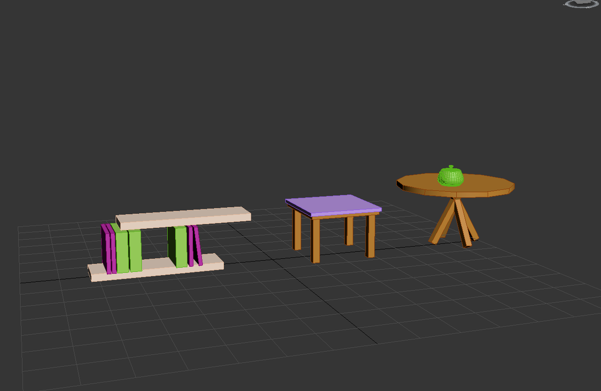

*Выполнение 1:*

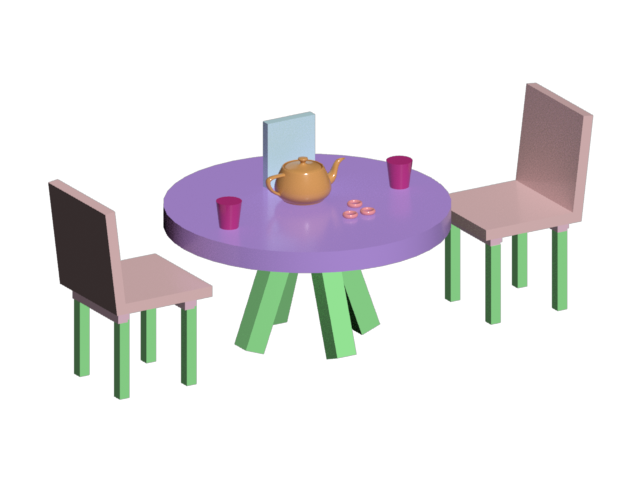

# Упражнение 2

Пользуясь изученными алгоритмами действий воссоздать интерьер на основе предложенного изображения. Обязательно используйте объекты из упражнения 1 и проявите фантазию! В процессе работы следует использовать различные приемы, которые позволят максимально быстро создавать несколько объектов и расставить их на равные расстояния относительно друг друга.

*Пример 2:*

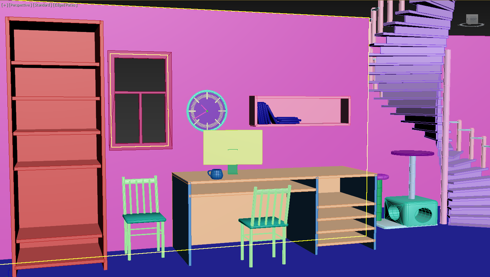

*Выполнение 2:*

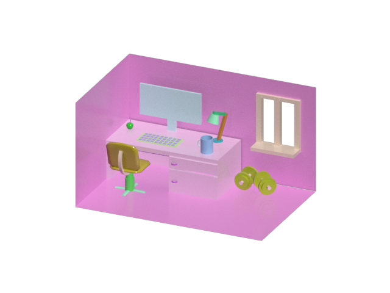

# Упражнение 3

Создайте сцену согласно рисунку. Более детальные ракурсы сцены доступны в архиве.

*Пример 3:*

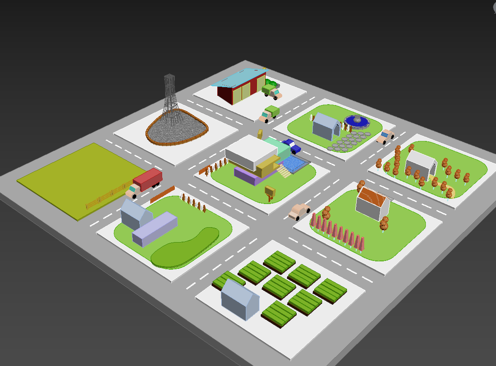

*Выполнение 3:*

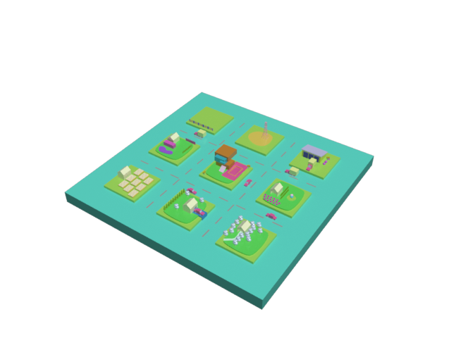

# Упражнение 4

Создайте макет маркера. Например, можно создать маркера согласно примеру показанному на рисунке.

*Пример 4:*

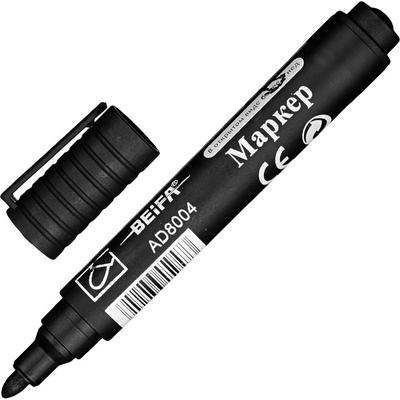

*Выполнение 4:*

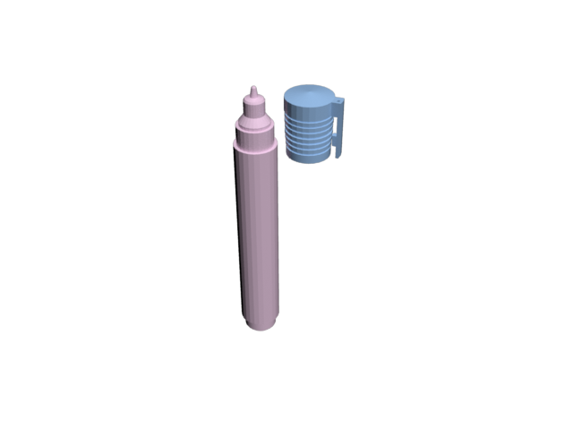

# Упражнение 5

На основе пройденного материала воссоздайте модель стула, например, такого как рисунке или любого другого.

*Пример 5:*

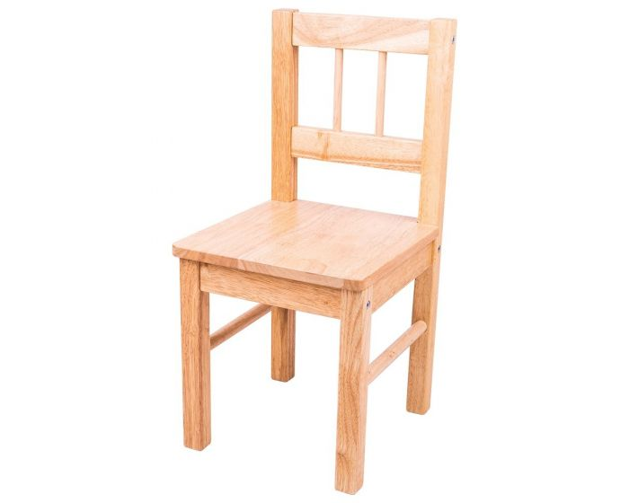

*Выполнение 5:*

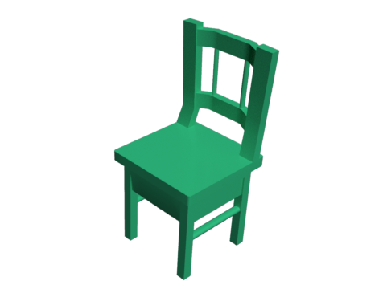

# Упражнение 8

Создайте модель пульверизатора аналогично лекционному материалу или любого другого (изображение пульверизатора обязательно прикрепите к выполненному заданию).

*Пример 8:*

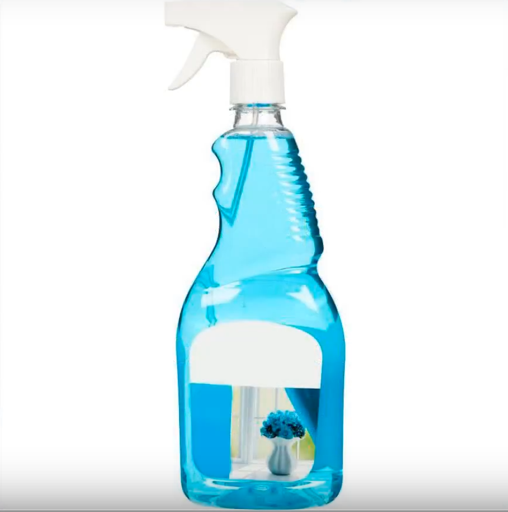

*Выполнение 8:*

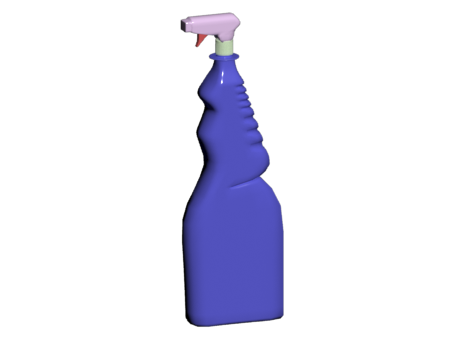

# Финальное упражнение

Повторите модель фонаря (используйте свои знания о сглаженных объектах).

*Пример:*

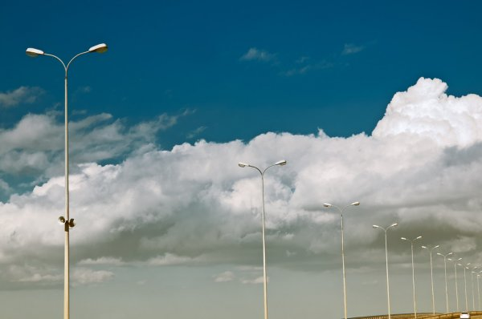

*Выполнение:*

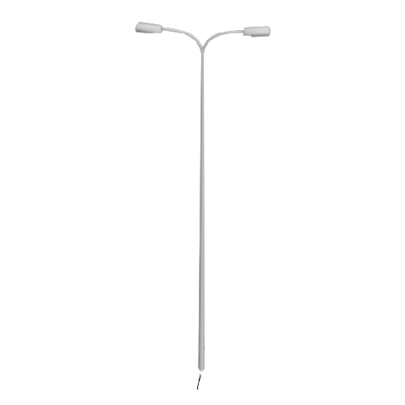