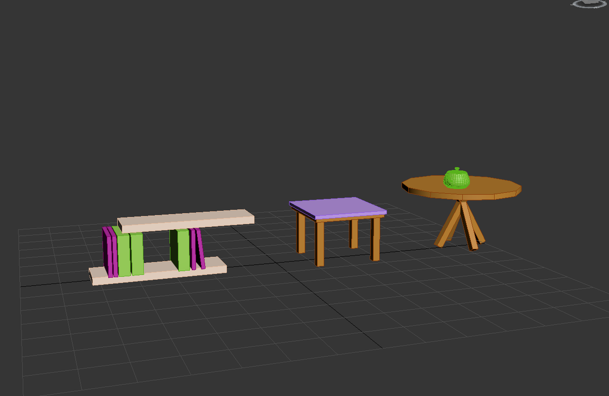
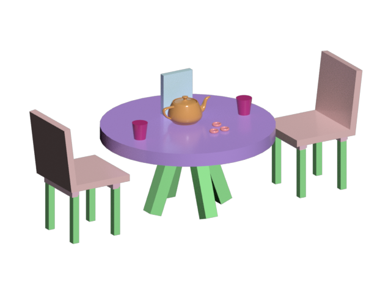
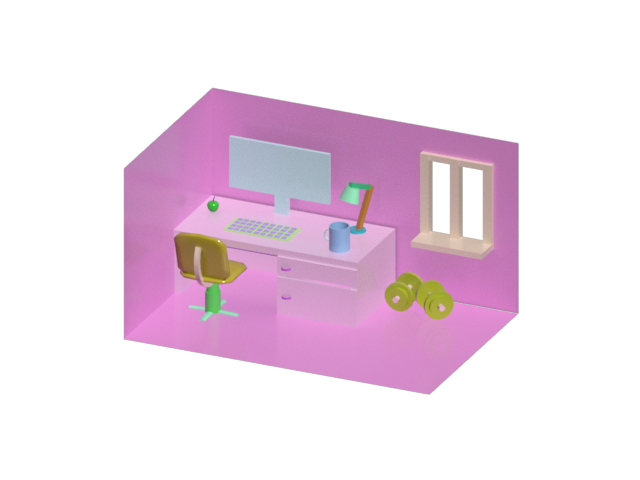
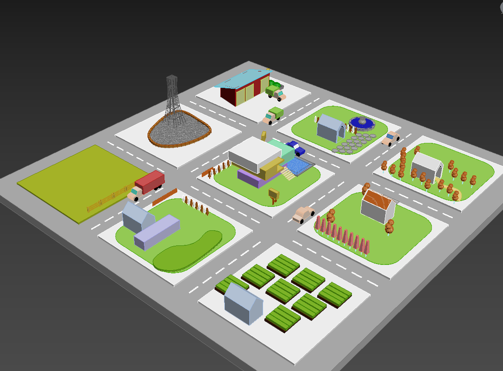
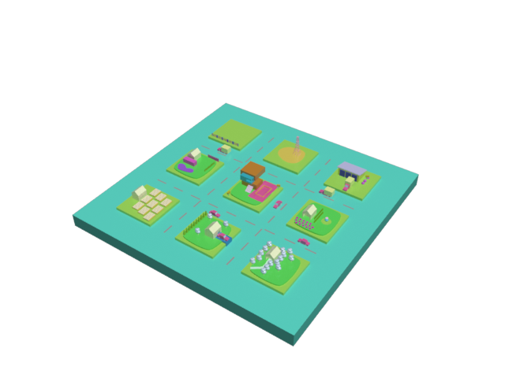

# Упражнение 1

При помощи примитивов создайте объекты на основе предложенного изображения. Проявите фантазию, можно создать любой объект интерьера! 

*Пример 1:*

*Выполнение 1:*

# Упражнение 2

Пользуясь изученными алгоритмами действий воссоздать интерьер на основе предложенного изображения. Обязательно используйте объекты из упражнения 1 и проявите фантазию! В процессе работы следует использовать различные приемы, которые позволят максимально быстро создавать несколько объектов и расставить их на равные расстояния относительно друг друга.

*Пример 2:*

*Выполнение 2:*

# Упражнение 3

Создайте сцену согласно рисунку. Более детальные ракурсы сцены доступны в архиве.

*Пример 3:*

*Выполнение 3:*

